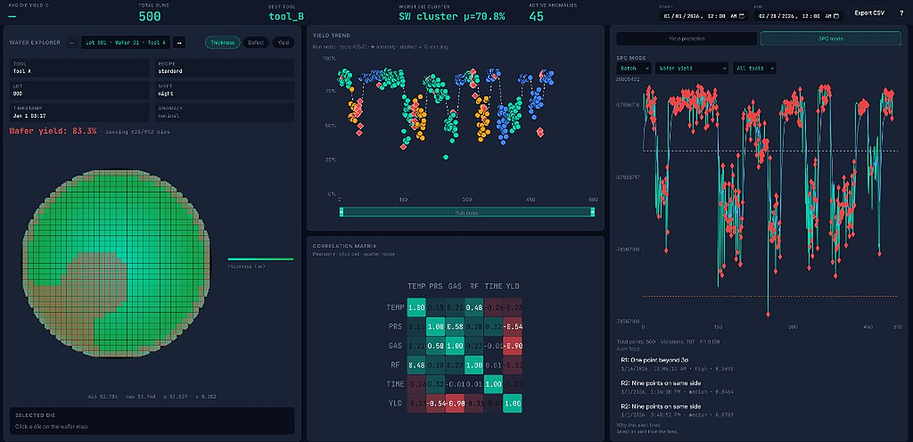

# Wafer Process Simulation & Yield Prediction

Repository: [github.com/GhostRuins/wafer-process-sim](https://github.com/GhostRuins/wafer-process-sim)

## Overview
Wafer is an end to end semiconductor process simulation and analytics platform that combines a physics based synthetic data generator, a constrained machine learning ensemble, and production style serving interfaces. It models CVD process behavior at wafer and die level, generates realistic manufacturing datasets, and predicts wafer yield with calibrated uncertainty for decision support.

In a semiconductor manufacturing context, the system is designed to reduce the gap between process intuition and deployable prediction. By embedding first principle relationships such as Arrhenius kinetics, saturation behavior, and monotonic constraints directly into the modeling stack, Wafer supports higher confidence root cause analysis, faster process window tuning, and safer optimization than black box modeling alone.

## Architecture


## Physics Model
- **Arrhenius + Langmuir-Hinshelwood film growth**: Film thickness is modeled with temperature dependent reaction kinetics (Arrhenius form) and surface coverage saturation (Langmuir-Hinshelwood), which captures both acceleration with thermal activation and diminishing growth at high reactant availability.
- **Murphy yield model vs Seeds/Poisson**: Murphy yield better represents clustered defect behavior and non-uniform spatial sensitivity, while Seeds/Poisson is simpler but can over-penalize or under-represent realistic defect interactions depending on regime.
- **Monotonicity constraints for trust**: Process engineers expect directional consistency, such as degradation with worsening defect indicators or unstable operating ratios. Enforcing monotonic relationships helps prevent physically implausible model behavior, improving model trust for process change decisions.

## ML Ensemble
| Model | Strength | Physics it captures |
|------|------|------|
| LightGBM quantile | Robust non-linear fit with fast training and direct prediction intervals | Process window non-linearities and heteroscedastic behavior via quantile outputs |
| XGBoost monotone | Strong constrained tree learner with stable directional behavior | Engineer expected monotonic trends across selected process-risk features |
| Gaussian Process | Probabilistic local interpolation with calibrated uncertainty | Smooth latent process response and confidence under sparse operating regions |
| Ridge meta-learner | Stable low-variance stacking layer | Consensus weighting across physics-informed base learners |

## Results
Metrics from `ml/artifacts/model_metrics.json`:

- Lot-CV R2: `0.987`
- Temporal holdout R2: `0.985`
- AUC-ROC: `0.996`

Key finding: the lot-stratified vs random CV gap is only `0.0014`, confirming the model learned process physics rather than memorizing lot-specific artifacts.

## Dashboard Features
<a href="docs/images/dashboard_2026.png">
  
</a>

**Layout (main grid)**

- **KPI bar**: average yield (today), total runs, best tool, worst die cluster, active anomalies, date range, CSV export, guided tour entry.
- **Wafer explorer**: run selector, wafer die map (thickness / defect / yield), edge exclusion ring, die detail card.
- **Yield trend**: per-run yield scatter, tool coloring, 10-run moving average, brush zoom.
- **Correlation matrix**: parameter–yield relationships with drill-down.
- **Right panel (toggle)**
  - **Yield prediction**: process sliders, tool choice, predict / optimize flows, ensemble yield + CI, optional SHAP-style contribution chart when the API returns it.
  - **SPC mode**: Nelson-rule SPC chart (batch or live WebSocket replay), alert feed, and **process capability** below the chart (see next section). Scroll the right panel if the chart fills the viewport—the capability block sits under *Total points / Violations*.

**Process capability (SPC mode)**

- Per-parameter **`Cp`**, **`Cpk`**, **`Pp`**, **`Ppk`** computed from `/api/process-runs` over the **same date range as the KPI bar**.
- **Recipe limits**: engineering bounds + LSL/USL/target live in [`frontend/src/config/processSpecs.ts`](frontend/src/config/processSpecs.ts); math in [`frontend/src/utils/capability.ts`](frontend/src/utils/capability.ts).
- **Tool scope**: *All tools* (pooled runs) or *SPC tool filter* (matches the tool dropdown on the SPC chart; required for tool-only capability).

## SPC Engine (Batch + Live Stream)
- **Batch analysis** via `POST /api/spc/analyze` with Nelson rules + EWMA outputs.
- **Live streaming** via WebSocket `ws://localhost:8000/ws/spc` with interactive playback controls in the dashboard.
- **Supported stream controls**: play, pause, stop, replay, and speed changes (`0.5x`, `1x`, `5x`, `10x`, `Max`) without restarting the server.
- **Stream payloads** are JSON-safe (datetime and numpy values normalized before transport).

## FDC SPC-ML Integration
- **Stateful SPC feature augmentation** is now part of both training and online inference via `wafer_sim/fdc/feature_augmentor.py`.
- **Western Electric rules** are evaluated per process parameter (`temperature`, `pressure`, `gas_flow`, `rf_power`, `deposition_time`) using a rolling control window (`SPCEngine`, default 25 points).
- **Augmented ML features** include:
  - `spc_alert_<param>` binary flags
  - `spc_alert_count`
  - `spc_severity_score`
- **Training flow**: rows are sorted by `timestamp` (and `run_id` if present), then SPC features are simulated sequentially before model fitting.
- **Inference/API flow**: `/api/predict` now returns SPC summary fields alongside yield prediction:
  - `spc_alerts_active`
  - `spc_severity`
  - `spc_alert_count`
- **Dashboard behavior**: prediction panel renders an SPC alert badge when active (amber for lower severity, red for higher severity).

### Quick API examples
Run batch SPC analysis:
```bash
curl -X POST "http://localhost:8000/api/spc/analyze" \
  -H "Content-Type: application/json" \
  -d "{\"metric\":\"wafer_yield\",\"start\":\"2026-01-01T00:00:00Z\",\"end\":\"2026-02-28T23:59:59Z\",\"include_points\":true}"
```

Inspect stream processor state:
```bash
curl "http://localhost:8000/api/spc/stream/state"
```

Open the dashboard, switch the right panel to **SPC mode**, choose **Stream**, then use the playback bar to run and control live replay.

### Process capability (control vs spec)
SPC answers whether the process is **stable** relative to control limits derived from the data stream. **Capability indices** answer whether a stable process **fits the engineering spec** (LSL/USL) with margin.

- **Cp / Cpk** use short-term variation: here, `σ_within` from the average moving range of consecutive runs (ordered by timestamp), `σ_MR / d₂` with `d₂ = 1.128` for subgroup size two.
- **Pp / Ppk** use long-term variation: sample standard deviation across all runs in the selected scope.
- **Tool scope**: *All tools* pools runs for a line-level view; *SPC tool filter* restricts to the tool chosen in the SPC chart dropdown (required for tool-scoped capability).

## Setup
1. **Clone the repository**
   ```bash
   git clone https://github.com/GhostRuins/wafer-process-sim.git
   cd wafer-process-sim
   ```
2. **Create and activate a Python environment**
   ```bash
   python -m venv .venv
   # Windows
   .venv\Scripts\activate
   # macOS/Linux
   source .venv/bin/activate
   ```
3. **Install backend dependencies**
   ```bash
   pip install -e ".[api,ml,dev]"
   ```
4. **Generate synthetic data**
   ```bash
   python -m wafer_sim.generator
   ```
5. **Train the ML ensemble**
   ```bash
   python -m ml.train --data data/wafer_summary.parquet --output-dir ml/artifacts --plots-dir ml/plots
   ```
6. **Run the FastAPI service**
   ```bash
   uvicorn api.main:app --reload --host 0.0.0.0 --port 8000
   ```
7. **Run the React dashboard**
   ```bash
   cd frontend
   npm install
   npm run dev
   ```

   The UI defaults the API base to `http://<your-host>:8000`. To override (different host or port), set `VITE_API_URL` before `npm run dev` (see [frontend/README.md](frontend/README.md)).

### Makefile shortcuts
From the repo root (requires `make` and the same venv activated):

| Target | Command |
|--------|---------|
| Generate data | `make generate` |
| Train models | `make train` |
| API server | `make api` |
| Frontend dev | `make frontend` |

### Docker Compose
Build and run API + Vite dev server in containers (API on **8000**, UI on **3000**):

```bash
docker compose up --build
```

## Design Decisions
Lot-stratified cross validation is used instead of random CV because semiconductor runs within a lot can share hidden correlations from common chamber state, wafer ordering effects, and short-term drift. Random splitting often leaks this structure across folds and inflates offline metrics. Grouping by lot forces the model to generalize across fabrication batches, which better matches deployment risk.

The feature `inv_temperature` is used instead of raw temperature because Arrhenius kinetics are approximately linear in inverse temperature after log transformation of rate-like responses. This encoding improves model efficiency by aligning with the expected physical response curve, reducing the burden on tree splits and improving extrapolation behavior near process window boundaries.

Murphy yield is preferred over Seeds/Poisson in this project because defect impacts are not purely random and independent across die regions. Murphy better captures clustered and spatially correlated defect behavior, which is common in real wafer processing. That gives more realistic synthetic labels and a better training target for downstream yield learning.

Gaussian Process is retained for uncertainty estimation even with higher computational cost because uncertainty quality directly affects process decisions. GP outputs provide smooth mean and variance estimates, and they are particularly valuable for sparse operating regions where tree ensembles can be overconfident. In this stack, GP uncertainty complements fast tree models and supports safer optimization and monitoring.
