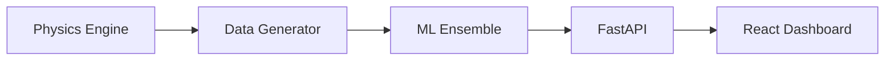
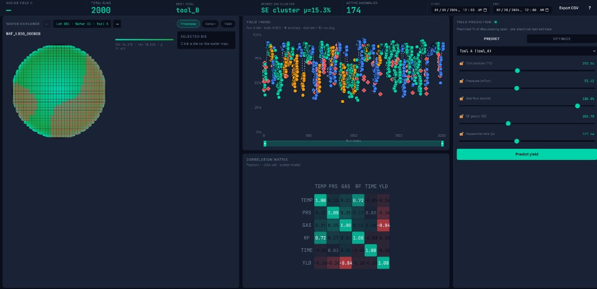

# Wafer Process Simulation & Yield Prediction

## Overview
Wafer is an end to end semiconductor process simulation and analytics platform that combines a physics based synthetic data generator, a constrained machine learning ensemble, and production style serving interfaces. It models CVD process behavior at wafer and die level, generates realistic manufacturing datasets, and predicts wafer yield with calibrated uncertainty for decision support.

In a semiconductor manufacturing context, the system is designed to reduce the gap between process intuition and deployable prediction. By embedding first principle relationships such as Arrhenius kinetics, saturation behavior, and monotonic constraints directly into the modeling stack, Wafer supports higher confidence root cause analysis, faster process window tuning, and safer optimization than black box modeling alone.

## Architecture


## Physics Model
- **Arrhenius + Langmuir-Hinshelwood film growth**: Film thickness is modeled with temperature dependent reaction kinetics (Arrhenius form) and surface coverage saturation (Langmuir-Hinshelwood), which captures both acceleration with thermal activation and diminishing growth at high reactant availability.
- **Murphy yield model vs Seeds/Poisson**: Murphy yield better represents clustered defect behavior and non-uniform spatial sensitivity, while Seeds/Poisson is simpler but can over-penalize or under-represent realistic defect interactions depending on regime.
- **Monotonicity constraints for trust**: Process engineers expect directional consistency, such as degradation with worsening defect indicators or unstable operating ratios. Enforcing monotonic relationships helps prevent physically implausible model behavior, improving model trust for process change decisions.

## ML Ensemble
| Model | Strength | Physics it captures |
|------|------|------|
| LightGBM quantile | Robust non-linear fit with fast training and direct prediction intervals | Process window non-linearities and heteroscedastic behavior via quantile outputs |
| XGBoost monotone | Strong constrained tree learner with stable directional behavior | Engineer expected monotonic trends across selected process-risk features |
| Gaussian Process | Probabilistic local interpolation with calibrated uncertainty | Smooth latent process response and confidence under sparse operating regions |
| Ridge meta-learner | Stable low-variance stacking layer | Consensus weighting across physics-informed base learners |

## Results
Metrics from `ml/artifacts/model_metrics.json`:

- Lot-CV R2: `0.987`
- Temporal holdout R2: `0.985`
- AUC-ROC: `0.996`

Key finding: the lot-stratified vs random CV gap is only `0.0014`, confirming the model learned process physics rather than memorizing lot-specific artifacts.

## Dashboard Features


- KPI bar with average yield, total runs, best tool, active anomalies, and date range filtering
- Interactive wafer map with metric toggles for thickness, defect density, and die yield
- Yield trend panel with anomaly markers, 10-run moving average, and zoom brush
- Correlation matrix for process parameter relationships to yield
- Prediction panel with scenario inputs, ensemble forecast, confidence interval, and explainability context
- Run explorer with lot/tool navigation and CSV export

## Setup
1. **Clone the repository**
   ```bash
   git clone <your-repo-url>
   cd Wafer
   ```
2. **Create and activate a Python environment**
   ```bash
   python -m venv .venv
   # Windows
   .venv\Scripts\activate
   # macOS/Linux
   source .venv/bin/activate
   ```
3. **Install backend dependencies**
   ```bash
   pip install -e ".[api,ml,dev]"
   ```
4. **Generate synthetic data**
   ```bash
   python -m wafer_sim.generator
   ```
5. **Train the ML ensemble**
   ```bash
   python -m ml.train --data data/wafer_summary.parquet --output-dir ml/artifacts --plots-dir ml/plots
   ```
6. **Run the FastAPI service**
   ```bash
   uvicorn api.main:app --reload --host 0.0.0.0 --port 8000
   ```
7. **Run the React dashboard**
   ```bash
   cd frontend
   npm install
   npm run dev
   ```

## Design Decisions
Lot-stratified cross validation is used instead of random CV because semiconductor runs within a lot can share hidden correlations from common chamber state, wafer ordering effects, and short-term drift. Random splitting often leaks this structure across folds and inflates offline metrics. Grouping by lot forces the model to generalize across fabrication batches, which better matches deployment risk.

The feature `inv_temperature` is used instead of raw temperature because Arrhenius kinetics are approximately linear in inverse temperature after log transformation of rate-like responses. This encoding improves model efficiency by aligning with the expected physical response curve, reducing the burden on tree splits and improving extrapolation behavior near process window boundaries.

Murphy yield is preferred over Seeds/Poisson in this project because defect impacts are not purely random and independent across die regions. Murphy better captures clustered and spatially correlated defect behavior, which is common in real wafer processing. That gives more realistic synthetic labels and a better training target for downstream yield learning.

Gaussian Process is retained for uncertainty estimation even with higher computational cost because uncertainty quality directly affects process decisions. GP outputs provide smooth mean and variance estimates, and they are particularly valuable for sparse operating regions where tree ensembles can be overconfident. In this stack, GP uncertainty complements fast tree models and supports safer optimization and monitoring.
